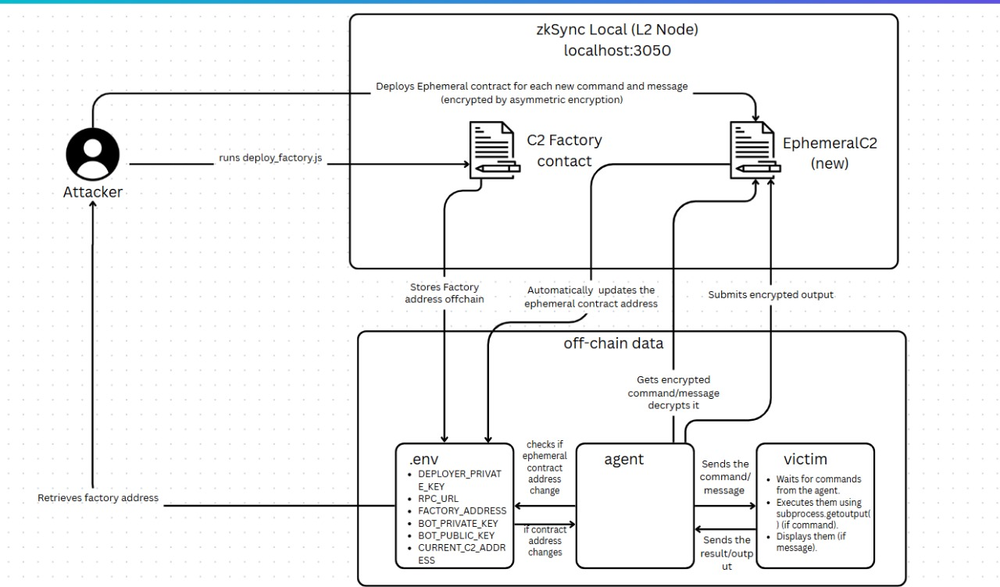

# zkSync-based Ephemeral C2 Infrastructure

A stealthy, decentralized, and ephemeral Command & Control (C2) infrastructure built using the zkSync blockchain and NaCl public-key encryption.

> **Disclaimer**: This project is intended strictly for educational and research purposes only.

---

## What is This Project?

This project presents a Proof-of-Concept (PoC) for a stealthy, decentralized Command & Control (C2) infrastructure that leverages the zkSync Layer 2 blockchain and modern cryptographic practices. It explores how zero-knowledge rollups can enable on-chain, encrypted, ephemeral communication with bots — avoiding traditional, traceable C2 channels entirely.

**Core Idea:** Use ephemeral smart contracts to issue one-time commands that are:

* End-to-end encrypted
* Immutable
* Anonymous
* Globally accessible

---

## Why This Project?

Traditional C2 channels (like HTTP, DNS, or sockets) leave behind traceable network artifacts. They can be detected, blocked, or monitored. This project solves that by:

* Using **zkSync**, a Layer 2 Ethereum solution, for low-cost and scalable contract deployment
* Leveraging **public-key encryption** with NaCl to secure payloads
* Eliminating callback mechanisms — the bot only pulls from the chain
* Deploying **one-time-use contracts** that cannot be reused or replayed

---

##  How It Works

### Actors:

* **Attacker:** Deploys commands on-chain using a smart contract
* **Agent (Bot):** Reads and decrypts commands, executes them via a local victim
* **Victim:** Executes shell commands forwarded by the bot

### Workflow:


1. Attacker encrypts a command using the bot’s public key (via `tweetnacl` in JavaScript)
2. Deploy it to a new ephemeral smart contract via zkSync
3. Bot polls for new contracts (using `.env`) and decrypts the command (via `PyNaCl`)
4. Forwards the command to a victim machine via TCP
5. Victim executes it and sends back the result
6. Bot encrypts the result with the attacker's public key and stores it on-chain

---

## Environment Setup

### Prerequisites

* Python 3.8+
* Node.js 16+
* Docker & Docker Compose
* Git

### Clone the Repository

```bash
git clone git@github.com:Alishba-Malik/zk_sync-C2.git
cd zkC2
```

### Python Setup

```bash
python3 -m venv env
source venv/bin/activate
pip install -r requirements.txt
```

### JavaScript Setup

```bash
npm install
```

### zkSync Local Node Setup

```bash
git clone [https://github.com/matter-labs/local-setup.git](https://github.com/matter-labs/local-setup.git)
cd local-setup
docker compose up
```

> This runs zkSync locally at `http://localhost:3050`

---

## .env Configuration

Create a `.env` file in the root:

```env
DEPLOYER_PRIVATE_KEY=<your_zksync_private_key>
FACTORY_ADDRESS=<deployed_factory_contract>
BOT_PRIVATE_KEY=<base64_bot_private_key>
BOT_PUBLIC_KEY=<base64_bot_public_key>
C2_PUBLIC_KEY=<base64_attacker_public_key>
RPC_URL=http://localhost:3050
CURRENT_C2_ADDRESS=<deployed_ephemeral_address>
```

---

##  Run the Project

### Step 1: Deploy the Factory Contract (once only)

```bash
node deploy/deploy_factory.js
```

> This only needs to be done once. The address is saved in `.env` as `FACTORY_ADDRESS`.

### Step 2: Encrypt and Deploy a Single Command/message

```bash
node deploy/deploy_c2.js "cmd:whoami"
node deploy/deploy_c2.js "MSG: Testing 123"

```

> Encrypts the command/message and deploys it via the factory. Sets `CURRENT_C2_ADDRESS` in `.env`.

### Step 3 (Required First-Time): Initialize zkSync with EphemeralC2 Bytecode

```bash
node deploy/preload_ephemeral.js
```

> This step is **required once initially** because zkSync needs to see the EphemeralC2 contract bytecode deployed at least once to recognize its hash. This script deploys a dummy instance to register the code hash on-chain.

### Step 4: Run the Agent

```
python bot/agent.py
```

> Fetches and decrypts command, forwards to victim, encrypts result, submits it back on-chain.

### Step 5: Run the Victim

Run victim on separate machine.
```
python victim.py
```

> The victim listens for commands and returns output.
